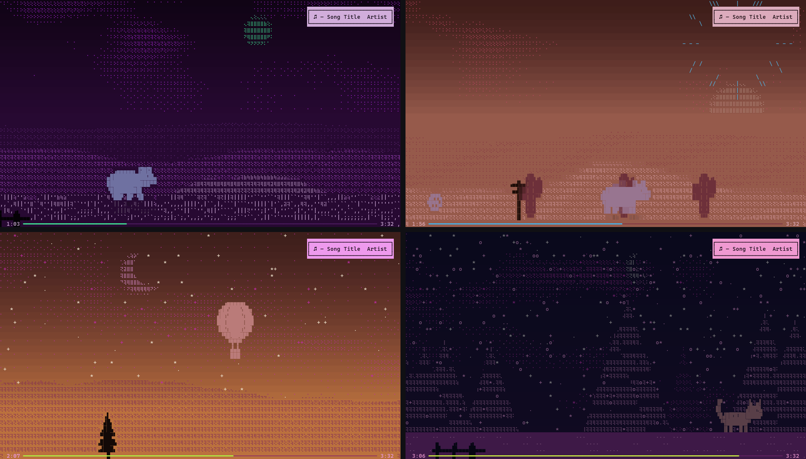

# spotify-ascii

**Spotify で流れている曲に合わせて、デスクトップの壁紙（またはターミナル）で色付きの ASCII アートの風景が動き出すビジュアライザー**（Windows 用）



曲ごとに違う風景と動物が現れ、ジャケットの色で染まり、音楽に合わせて動きます。
曲が進むと昼から夕焼け、夜へと時間が流れ、動物は下のシークバーと一緒に画面を横切っていきます。

> English summary is at the bottom.

---

## 特長

- **曲ごとに違う風景**：丘・海・雨・夜空・森・オーロラ・砂漠・雪・街など。ジャケットの色から合う風景を選びます（青なら海、緑なら森、暗ければ夜…）。
- **ジャケットで色が決まる**：アルバムアートから色を取り出して画面全体を塗ります。`n` キーでジャケットそのものの ASCII 表示にも切り替えられます。
- **曲の時間 = 1日の時間**：前半は昼、中盤から夕焼け、終盤は夜になり、星と月が出て、ビートに合わせて流れ星が流れます。
- **音楽に合わせて動く**：PC の音からテンポと拍を推定し、動物の足取りやジャケットの脈打ちを拍に合わせます。
- **動物はシークバーと一緒に旅をする**：曲の始まりに左から歩いてきて、終わりに右へ去り、次の曲の動物と交代します。一時停止すると座り込んで眠ります。地面には動物と同じ形の影が落ち、時間帯で長さと濃さが変わります（夜は消えます）。
- **同じアルバムなら同じ動物**：アルバムを通して聴くと、同じ動物が風景を変えながら旅を続けます。
- **奥行き**：背景は遠くほどゆっくり、手前の木や柵は速く流れます。
- **高精細**：点字文字（⣿）を使って 1 マスを 2×4 ドットで描きます。
- **軽い**：ウィンドウを最小化している間は描画を止め、一時停止中はコマ数を落とします。処理が追いつかない PC や大きな画面では、自動でコマ数を下げて滑らかさを保ちます。
- **ログイン不要・通信なし**：Spotify の API もアカウント連携も使いません。Windows が表示している「再生中の曲」の情報を読むだけです。

## 必要なもの

- Windows 10 / 11
- [Spotify デスクトップアプリ](https://www.spotify.com/download/)
- [Windows Terminal](https://aka.ms/terminal)（おすすめ。Windows 11 には最初から入っています）
- Python 3.9〜3.12（無ければ初回起動時にインストールを案内します）

## 使い方

1. [Releases](https://github.com/Nishi-Yura/spotify-ascii/releases/latest) から `spotify-ascii.zip` をダウンロードして展開します（または **Code → Download ZIP** / `git clone`）。
2. フォルダの中の **`run.bat`** をダブルクリックします。
   - 初回だけ、必要なライブラリを自動でインストールします（数分かかります）。
   - Python が無い場合は、その場で Python 3.12 をインストールするか聞かれます。
3. Spotify で曲を再生すると、**デスクトップの壁紙**（アイコンの裏）で絵が動き出します。

開いたターミナルはリモコンです。キー操作の一覧と今の設定がいつも表示されていて、そのターミナルでキーを押すと壁紙が変わります。
ターミナルを閉じる（または `q`）と終了し、普段の壁紙に戻ります（壁紙の設定は変更しません）。最小化しておくのは問題ありません。

`t` キーで、絵を壁紙ではなくターミナルの中に出す「ターミナル表示」に切り替えられます（もう一度 `t` で壁紙に戻ります）。

Spotify を起動したときに自動で開きたい場合は **`watch.bat`** を使ってください（下の「自動で起動する」を参照）。

### キー操作（壁紙モード・標準）

| キー | 動作 |
|---|---|
| `n` | 風景 ⇄ ジャケット表示 を切り替え（曲ごとに記憶） |
| `w` | ダーク ⇄ ホワイト を切り替え（標準はダーク。選んだ方を記憶） |
| `+` `-` | 壁紙の細かさを変える（`+` で細かく。標準は 72 行。細かいほど重くなります） |
| `1` `2` … | そのモニターに 出す / 出さない（モニターは左から 1, 2, …） |
| `a` | すべてのモニターに出す |
| `i` | 曲名とシークバーを 表示 / 非表示 |
| `[` `]` | ビートのタイミングを 20ms ずつ早く / 遅く（Bluetooth イヤホンなどで音が遅れて聞こえる場合の補正） |
| `t` | ターミナル表示に切り替え |
| `q` | 終了（壁紙も元に戻ります） |

- 標準ではメインのモニターだけに出します。`1` `2` … で 1 枚だけ・2 枚・全部など自由に選べます。モニターの一覧と、それぞれに出しているかどうかもターミナルに表示されます。
- 選んだ設定はすべて保存され、次に起動したときもそのままです。
- 他のアプリを最大化・全画面にしている間は、そのモニターの描画を止めるので、作業やゲームの邪魔をしません。
- 文字ではなく点そのものを画面の画素にそのまま描くので、ターミナルと同じくらいくっきりします。

### キー操作（ターミナル表示）

| キー | 動作 |
|---|---|
| `n` `w` `i` `[` `]` | 壁紙モードと同じ |
| `+` `-` | 文字の大きさ（＝絵の細かさ）を変える。古いコンソールでは起動時に約2倍細かくなります。Windows Terminal では `Ctrl` + `+` / `Ctrl` + `-` を使ってください |
| `t` | 壁紙モードに戻る |
| `?` | 操作の一覧を表示 / 閉じる |
| `q` | 終了 |

### 自分の動画を流す

`media` フォルダに `アーティスト名 - 曲名.mp4`（`.gif` や `.png` も可）を置くと、その曲のときは風景の代わりにその動画がカラー ASCII で再生されます。
mp4 などの動画を使うときだけ、最初に一度 **`video-support.bat`** を実行してください（動画用のライブラリを追加します。gif と png はそのまま使えます）。詳しくは [media/README.txt](media/README.txt) を見てください。

### 自動で起動する

- PC の起動時から壁紙にしたい場合は **`autostart.bat`** を一度実行してください。サインインすると最小化された状態で起動します（もう一度実行すると解除）。
- `watch.bat` を起動しておくと、Spotify が立ち上がったときに起動し、Spotify を閉じると自動で終了します。PC の起動時から待機させたい場合は、`Win + R` で `shell:startup` を開き、`watch.bat` のショートカットを置いてください。

どちらの場合も、同時に動くのは 1 つだけです（2 つ目は起動しません）。

### コマンドラインオプション

```
run.bat --terminal     ターミナル表示で起動
run.bat --white        ホワイトで起動
run.bat --scene ocean  全曲このシーンにする（--list で一覧）
run.bat --no-audio     音に反応させない
run.bat --fps 6        フレームレートを下げる（重いとき。標準は 壁紙 10 / ターミナル 30）
run.bat --any-player   Spotify 以外（ブラウザなど）の再生にも反応する
```

## うまく動かないとき

- **文字が「？」や □ になる**：Windows Terminal で、フォントを Cascadia Mono（標準）にしてください。古いコマンドプロンプトのフォントは点字文字に対応していません。
- **絵が粗い／もっと細かくしたい**：壁紙は `+` キーで細かくなります。ターミナル表示では `+` キー（古いコンソール）か、Windows Terminal なら `Ctrl` + `-` で文字を小さくすると、マス数が増えて細かくなります。
- **動きが重い**：自動でコマ数を調整しますが、壁紙なら `-` キーで粗くする・出すモニターを減らす、ターミナル表示ならウィンドウを小さくすると軽くなります。
- **音に反応しない**：既定の再生デバイスから音が出ているか確認してください。再生デバイスの音をそのまま解析しています。
- **ビートが少しずれて見える**：`[` `]` キーで合わせられます（値は保存されます）。
- **曲が認識されない**：Spotify デスクトップアプリで再生しているか確認してください（Web 版はそのままでは対象外です。`--any-player` を付けると反応します）。

## 仕組み

| ファイル | 内容 |
|---|---|
| `main.py` | メインループ、壁紙モードとターミナル表示の切り替え、操作一覧、キー操作 |
| `nowplaying.py` | Windows のメディア情報から曲名・アーティスト・ジャケット・再生位置を取得 |
| `audio.py` | 再生音の解析（音量・スペクトラム・テンポと拍の推定） |
| `scenes.py` | 各シーン、時間帯、影、背景のスクロール |
| `sprites.py` | 動物や小物のシルエット（図形の組み合わせで定義） |
| `media_scenes.py` | ジャケット表示と、`media` フォルダの動画再生 |
| `palette.py` | ジャケットからの配色とシーン選び |
| `render.py` | フルカラーの文字描画、点字による高精細描画 |
| `wallpaper.py` | 壁紙（選んだモニターのデスクトップのアイコンの裏に描画） |

新しいシーンは `scenes.py` で `Scene` を継承したクラスを作り、`ALL` に登録すると追加できます。

## 注意

- これは個人が作った非公式のツールで、Spotify とは関係ありません。
- 設定（`app_settings.json`）と曲ごとの選択（`track_scenes.json`）は、このフォルダの中にだけ保存されます。

## ライセンス

[MIT License](LICENSE)

---

## English

**A visualiser for Windows that turns the song playing in Spotify into animated, full-colour ASCII scenery on your desktop wallpaper (or in the terminal).**

- A scene and an animal for every song (hills, sea, rain, night sky, forest, aurora, desert, snow, city…), coloured by the album art. Press `n` to show the album art itself as ASCII.
- The song is a day: day → sunset → night with stars and shooting stars on the beat.
- Tempo and beat are estimated from what your PC is playing; the animal walks in time and crosses the screen with the seek bar, hands over to the next song's animal, and falls asleep when you pause. Its shadow changes with the time of day.
- No Spotify API, no login, no network: it reads Windows' "now playing" media information.

**Requirements:** Windows 10/11, the Spotify desktop app, Windows Terminal (recommended), Python 3.9–3.12 (the first run offers to install it).

**Run:** download `spotify-ascii.zip` from Releases, extract it and double-click `run.bat`. The first run installs the dependencies into a local `.venv`. The picture becomes your desktop wallpaper (behind the icons, paused while other windows are maximised); the terminal window stays open as the remote control, always listing the keys. Closing it (or `q`) stops everything and brings your normal wallpaper back. `t` switches to drawing the picture in the terminal instead. `autostart.bat` toggles starting it (minimised) at sign-in; `watch.bat` starts it whenever Spotify starts.

**Keys (wallpaper):** `n` scenery ⇄ album art · `w` dark ⇄ white · `+` `-` finer / coarser · `1` `2` … show on that monitor or not (numbered left to right) · `a` all monitors · `i` title and seek bar on/off · `[` `]` shift beat timing · `t` terminal view · `q` quit. In the terminal view `+` `-` change the text size (classic console; use Ctrl +/- in Windows Terminal), `?` shows the keys and `t` goes back to the wallpaper.

**Videos:** put `Artist - Title.mp4` (or .gif/.png) in `media/`; run `video-support.bat` once for mp4/webm/mov playback.

Unofficial project, not affiliated with Spotify. MIT licensed.
